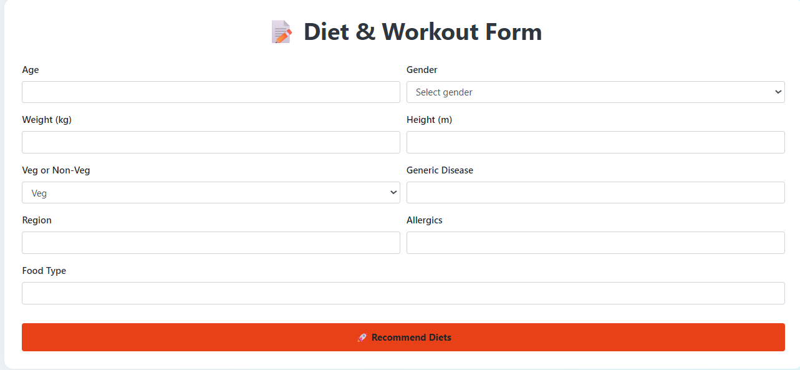
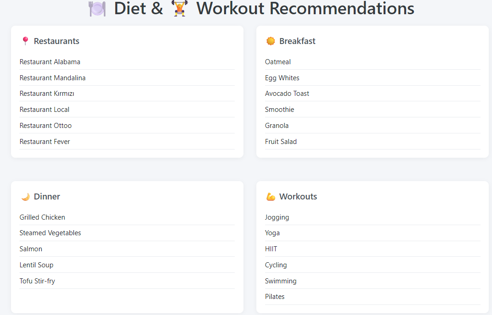

# 🥗 Diet & Workout Recommendation System | Diyet ve Egzersiz Öneri Sistemi

📘 [English](#english-version) | 📗 [Türkçe](#türkçe-versiyonu)

---

## 📘 English Version

### 🎯 Project Description

This is an intelligent diet and workout recommendation system that leverages **OpenAI's GPT model** to generate personalized suggestions for:

- 🏢 Restaurants
- 🍳 Breakfast
- 🍽️ Dinner
- 💪 Workouts

Based on user's input (age, gender, weight, height, dietary preferences, diseases, allergies, etc.), the system provides targeted and healthy suggestions.

---

### ⚙️ Tech Stack

- **Backend:** Flask (Python)
- **Frontend:** HTML + Bootstrap
- **AI Model:** LangChain + OpenAI GPT
- **Regex:** For structured data extraction from language model output

---

### 🚀 How It Works

1. User fills the form with personal health and diet info
2. The data is passed to an OpenAI-powered LLM via LangChain
3. The LLM responds with structured suggestions
4. Regex is used to extract and format the response
5. The results are displayed in a clean HTML page

---

### 📸 Screenshots

| Form Page | Results Page |
|-----------|--------------|
|  |  |

---

### 📂 Project Structure

```
diet-recommendation-app/
│
├── app.py                # Flask backend with OpenAI integration
├── templates/
│   ├── index.html        # Input form
│   └── result.html       # Output page
├── static/               # (Optional static CSS or JS)
└── README.md             # You are here!
```

---

### 🔑 Setup Instructions

1. Clone the repository:
   ```bash
   git clone <repo-url>
   cd diet-recommendation-app
   ```

2. Install dependencies:
   ```bash
   pip install flask openai langchain
   ```

3. Add your OpenAI key:
   ```python
   os.environ["OPENAI_API_KEY"] = "your-api-key"
   ```

4. Run the app:
   ```bash
   python app.py
   ```

---

## 📗 Türkçe Versiyonu

### 🎯 Proje Açıklaması

Bu proje, **OpenAI GPT modeli** ile çalışan akıllı bir diyet ve egzersiz öneri sistemidir. Kullanıcının aşağıdaki bilgilerine göre öneriler sunar:

- 🏢 Restoran isimleri
- 🍳 Kahvaltı menüsü
- 🍽️ Akşam yemeği seçenekleri
- 💪 Egzersiz planları

Girdiğiniz yaş, cinsiyet, boy, kilo, hastalık, alerji gibi bilgilere göre **kişisel öneriler** üretir.

---

### ⚙️ Kullanılan Teknolojiler

- **Backend:** Flask (Python)
- **Frontend:** HTML + Bootstrap
- **Yapay Zeka:** LangChain + OpenAI GPT
- **Veri Çekimi:** Regex ile metin ayrıştırma

---

### 🚀 Nasıl Çalışıyor?

1. Kullanıcı formu doldurur
2. Bilgiler OpenAI destekli LLM'e gönderilir
3. Yapay zeka öneri metni üretir
4. Regex ile bu metinden veriler ayrıştırılır
5. Öneriler kullanıcıya sunulur

---

### 📸 Ekran Görselleri

| Form Sayfası | Sonuç Sayfası |
|--------------|----------------|
|  |  |

---

### 📂 Proje Yapısı

```
diet-recommendation-app/
│
├── app.py                # Flask backend (OpenAI ile bağlantı)
├── templates/
│   ├── index.html        # Kullanıcı formu
│   └── result.html       # Sonuç ekranı
├── static/               # (İsteğe bağlı CSS veya JS)
└── README.md             # Bu döküman
```

---

### 🔧 Kurulum Adımları

1. Reponun kopyalanması:
   ```bash
   git clone <repo-url>
   cd diet-recommendation-app
   ```

2. Gereken kütüphanelerin yüklenmesi:
   ```bash
   pip install flask openai langchain
   ```

3. OpenAI API anahtarını tanımlayın:
   ```python
   os.environ["OPENAI_API_KEY"] = "your-api-key"
   ```

4. Uygulamayı çalıştırın:
   ```bash
   python app.py
   ```

---

### 🧠 Notlar

- Proje OpenAI API kullanır, bu nedenle API limiti dolarsa yanıt alınamayabilir.
- LangChain sayesinde prompt yapısı kolayca düzenlenebilir.
- Arayüz responsive'dir ve mobilde de uyumludur.

---

### 👤 Developed by

Nurcan Yaz  
Computer Engineer | AI Engineer 
[LinkedIn](https://www.linkedin.com) • [GitHub](https://github.com)